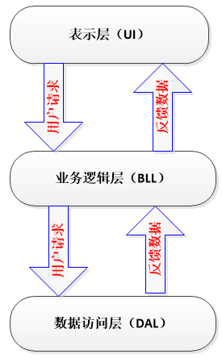

# 会议议程管理 Agenda 

**（项目为2016年中山大学数据科学与计算机学院软件工程实训课题，[头文件](./include)与[需求文档](./Requirement.md)由学院方面提供，版权归中山大学所有）**

## 简介

开发一个基于命令行的议程管理系统。
- 系统需提供用户登录，新用户注册
- 已注册用户登陆后用户可以
    - 注销(delete)当前用户账户，查询(query)用户名单
    - 也可以添加(add)、删除(delete)、查询(query)系统中记录的会议安排等管理功能

## 具体需求

详见[需求文档](./Requirement.md)。

## 架构

- 项目采用典型的三层架构：



- 各层的类分别为：

    - 表示层：[AgendaUI](./include/AgendaUI.hpp)
    - 业务逻辑层：[AgendaService](./include/AgendaService.hpp)
    - 数据访问层：[Storage](./include/Storage.hpp)

- 主要数据主体类：
    - 用户：[User](./include/User.hpp)
    - 会议：[Meeting](./include/Meeting.hpp)
    - 相关数据类：
        - 日期：[Date](./include/Date.hpp)
        - 数据文件路径：[Path](./include/Path.hpp)

## 使用指南

### 系统环境

Linux

### 编译器

g++（需要支持C++11）

### 自动化建构工具

make

### 运行方式

```bash
# 获取项目内容
git clone https://github.com/xujj25/Agenda.git

# 进入项目主目录
cd Agenda

# 编译
make

# 运行
./bin/main
```

## 亮点

- 本项目通过学院评测系统所有单元测试，验收评级为A
- 初探make自动化建构，进一步熟悉在Linux下进行开发
- 使用了多种C++11特性，包括智能指针（用于保存全局单例）、函数模板、Lambda表达式（作为CRUD的过滤器）等
- 初步接触设计模式，包括单例模式等
- 启动时载入硬盘数据，CRUD时只修改内存中的数据对象，提升操作速度
- 内存数据一经修改则进行脏标记，退出程序时若已脏标记才将内存数据回写到硬盘
- 敏感操作（如修改用户密码）二次鉴权
- 对非法输入的防御：所有的人为输入都以`string`暂存，包括数字

## 可提升点

- 硬盘数据存储简陋：改用数据库保存数据，对密码等敏感信息进行哈希等保护
- 内存数据安全性问题：当人为终止或异常崩溃的时候将内存中已经修改的数据回写到硬盘（提升回写频率、异常或者终止信号处理）
- 健壮性：可以增加异常与信号处理
- UI较为简陋：可以考虑使用GUI客户端，使用网络进行连接
- 不能并发使用：改用C/S架构，加入I/O多路复用和线程池

